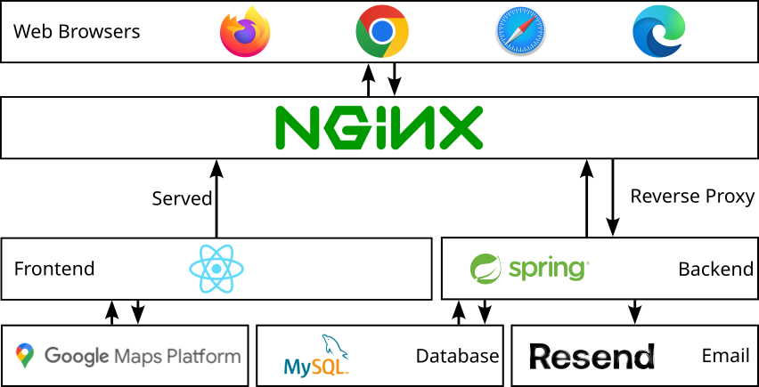

# RepairRadar
This repository houses the frontend and backend components for RepairRadar, a web application developed for Professor Pierantozzi’s Fall 2023 Software Engineering I class at Rowan University.

## Purpose
Repair Radar is a dynamic web application designed as a pivotal link between service providers and individuals in need of repair services. The system streamlines the repair process by allowing users to submit detailed repair requests, to which service providers can efficiently match and respond. At its core, Repair Radar is equipped to manage the entirety of the data associated with repair requests and user accounts.

## Frontend
This folder serves as the user interface for RepairRadar, providing a seamless and interactive experience. Please refer to [frontend-app/README.md](./frontend-app/README.md) for detailed information on installation, scripts, and configuration.

## Backend
The backend for RepairRadar handles server-side logic and interacts with databases. Please refer to [backend/README.md](./backend/README.md) for detailed information on running, testing, and deploying the backend.

### System Organization
Repair Radar is multi-tiered. Starting with the database, server-side application, and finally the client's interface.

